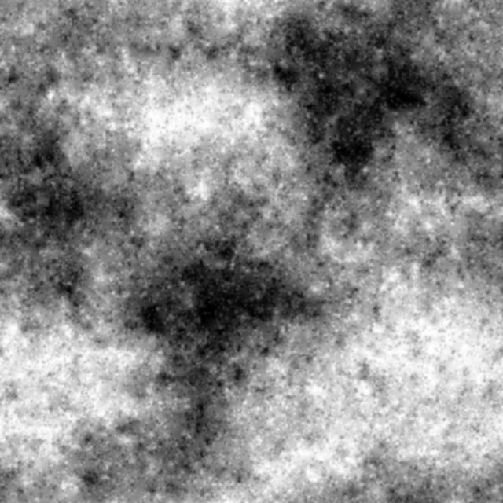
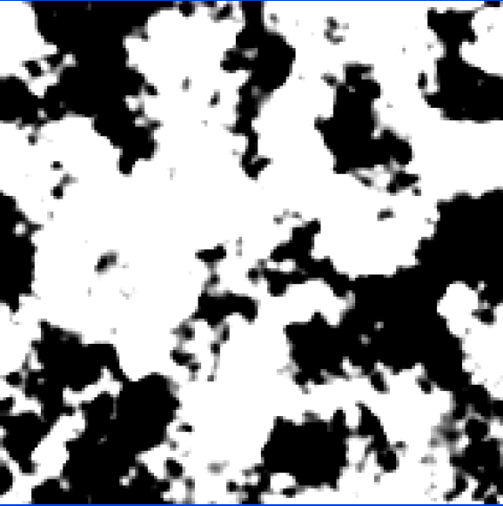
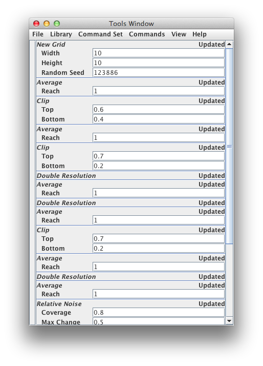
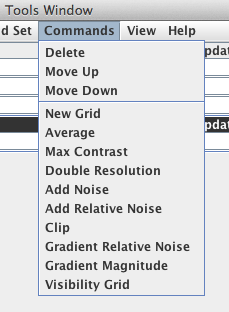

Grid-Fractals
=============

This a program uses basic image processing functions to create random
fractal like images. 

Features:

* The commands are savable to simple text files. 
* The output of each command is viewable at each stage. 
* All random seed values are included in the parameters so that the same image can be reproduced when the command file is loaded.

##Commands

 

 Command | Description 
 --- | --- 
 New Grid | creates a new grid of random values with the given width and height and seed
 Average  | sets the grid cell to the average if its neighbors with the distance to average over setable. After averaging it runs a max contrast (see bellow).
 Max Contrast | scales everything so the largest value is white and the darkest value is black
Double Resolution | doubles the number of pixels vertially and horizontally
Add Noise | randomly adds noise to the image
Add Relative Noise | adds random noise to the current value
Clip | scales the values so that the top value is scaled to become 1.0 and the bottom value becomes 0.0. Anything outside the range are clipped to the range 0.0 to 1.0
Gradient Relative Noise | adds noise in areas where the gradien falls between the min and max values.
Gradient Magnatude| converts the image into the magnitude of the gradient at each pixel
Visibility Grid| sets the grid value to 0.0 if GCD(x,y) = 1 and 1.0 otherwise. This also the pattern of visibility from the origin if one were looking at a the grid from the side. More info at Wikipedia [Coprime Integers](http://en.wikipedia.org/wiki/Coprime_integers) and the mysterious probability 6/pi^2.
